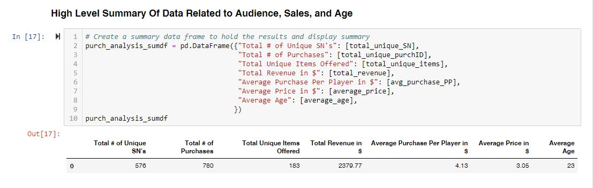
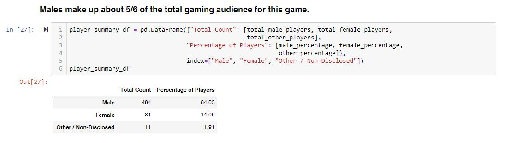
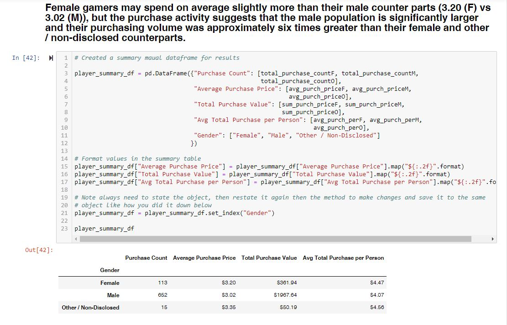
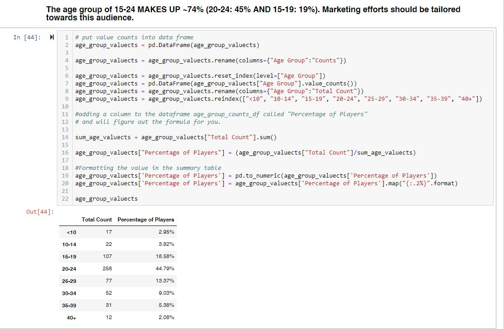
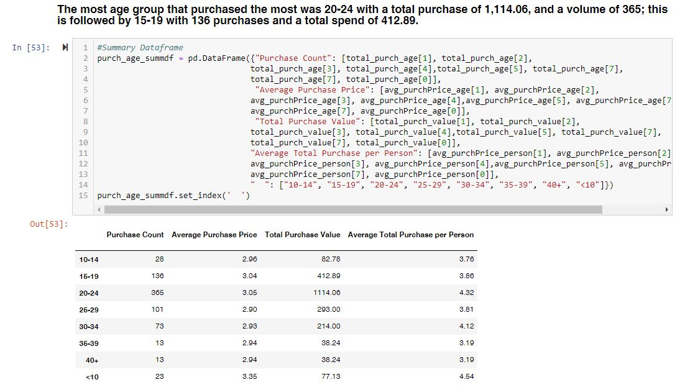
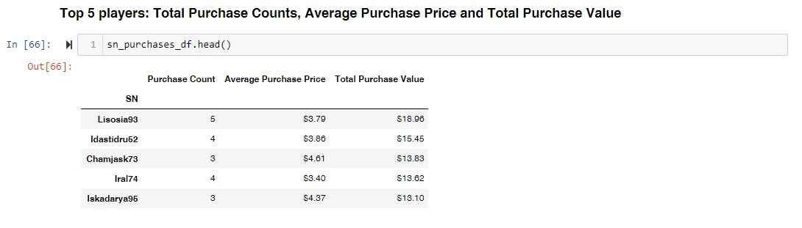
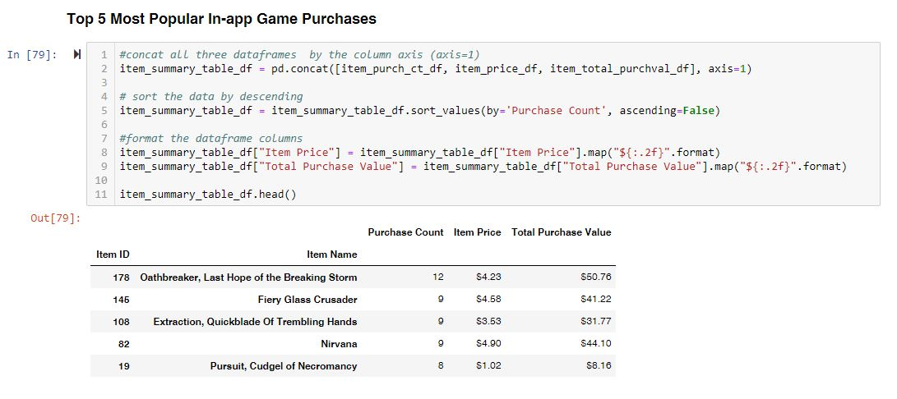

# Heroes of The Land Game Analysis

## Project Scope:
Using Python and Pandas library, I did an analysis on the gaming data collected by the company using Jupyter Notebook. There's an analysis on quantity and quality aspect of the players, game purchases, gender demographics, game purchases based on gender, age demographics, purchasing patterns based on age, top spenders, profitable items, and popular items.

### Prerequisites

* Python3
* Pandas
* Jupyter Notebook

## Getting Started

The easiest way to review my analysis is to simply click on the "pandas_game_data_analysis.ipynb" in my repository on the GitHub website. GitHub is able to read Jupyter Notebook. Otherwise, if you want to download the repository, you will need to have Jupyter Notebook installed on your computer and clone / download the repository cloned to your computer.

## Summary of Findings
* Of the 1163 active players, the vast majority are male (84%). There also exists, a smaller, but notable proportion of female players (14%).
* Our peak age demographic falls between 20-24 (44.8%) with secondary groups falling between 15-19 (18.60%) and 25-29 (13.4%).

* The game is averaging about 1.35 transaction per unique player. Not all player makes purchases in the game.
* Male players made up 85% of their purchases for a total of 1,967, averaging about 4.07 per player.
* About %75 of  their players are between the ages of 15 to 29, with 45% of them being in the age group of 20 – 24.
* Players in the age group of 20 -24 had the highest purchase count (365) and spent on average of 4.32.
* Conversely, the lowest number of transactions and spend came both age groups of 35 to 39, and 40, where both groups had     13 transactions with an average of 3.20.
* Their top spenders spent between 13.10 to 18.96, with minimum of 3 to max 5 purchase counts.
* Their most profitable item was “Oathbreaker, Last Hope of the Breaking Storm” for a total of 12 purchases with a total     revenue of 50.76.

## Output

## Author

* **Johneson Giang** - *Individual Project* - [Github](https://github.com/jhustles)

## License

This project is licensed under the MIT License - see the [LICENSE.md](LICENSE.md) file for details